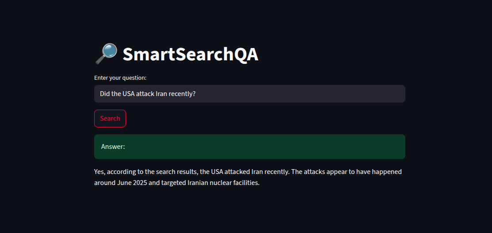

# 🔍 SmartSearchQA

SmartSearchQA is a lightweight, real-time question-answering app that combines the power of web search with large language models. It uses [LangChain](https://www.langchain.com/), [Tavily](https://www.tavily.com/) for live web results, and [Google Gemini](https://ai.google.dev/) (via `langchain-google-genai`) for intelligent answer generation.

Built with a minimal [Streamlit](https://streamlit.io/) UI, it’s ideal for research, news checking, or quick factual Q&A.

---

## 🚀 Features

- 🔎 Real-time web search via Tavily API
- 🧠 Answer generation using Gemini 2.0 Flash LLM
- ⚡ Fast, interactive, and extendable with LangChain
- 🖥️ Clean UI built with Streamlit

---

## 📦 How It Works

Below is an example of how SmartSearchQA answers a real-time query:



The agent fetches live data using web search and synthesizes an answer using Gemini.

---

## 🛠️ Setup Instructions

### 1. Clone the Repository
```bash
git clone https://github.com/yourusername/SmartSearchQA.git
cd SmartSearchQA
